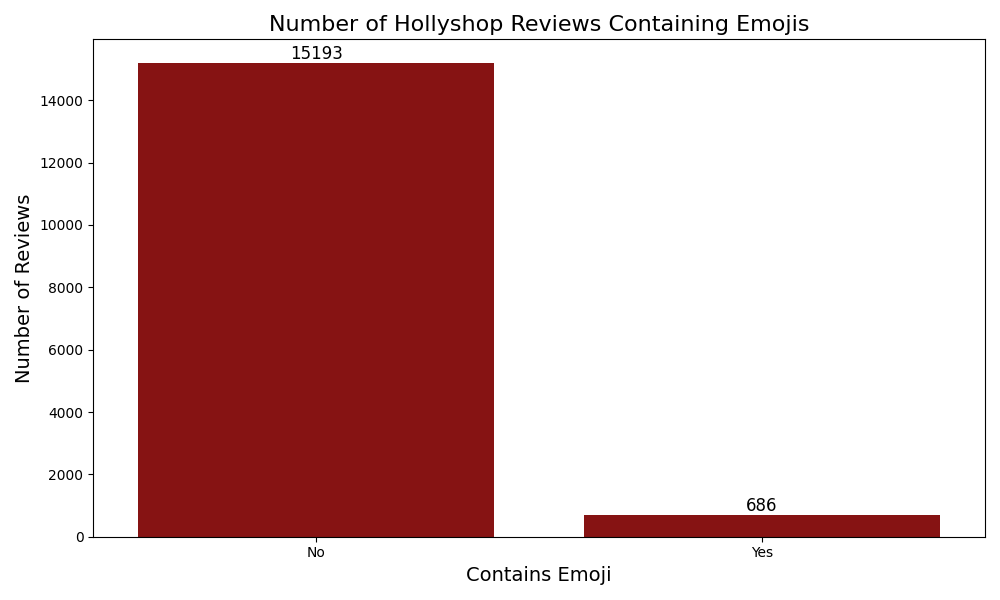
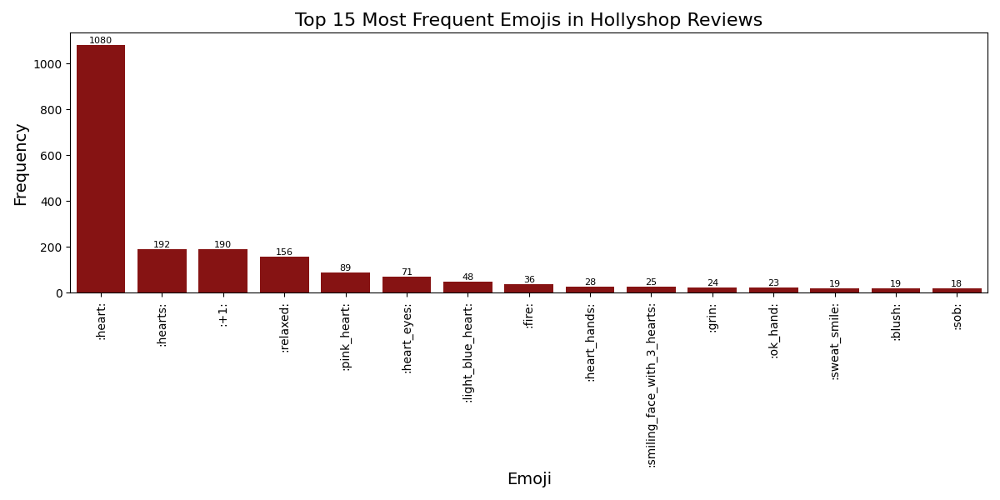
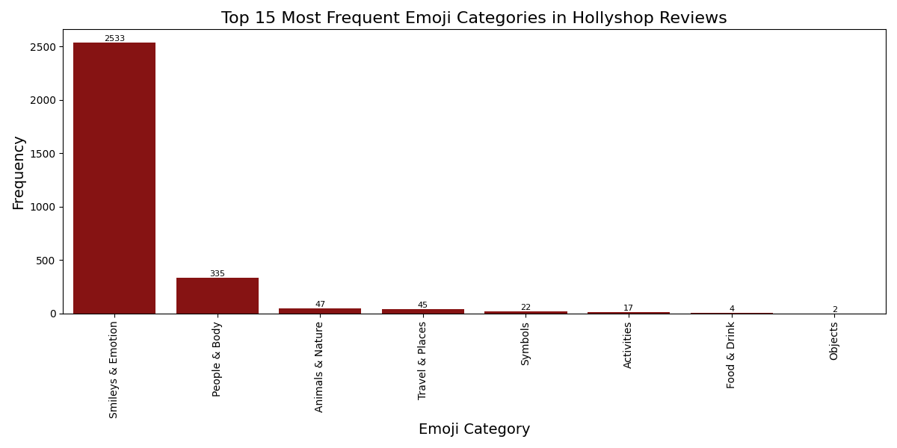
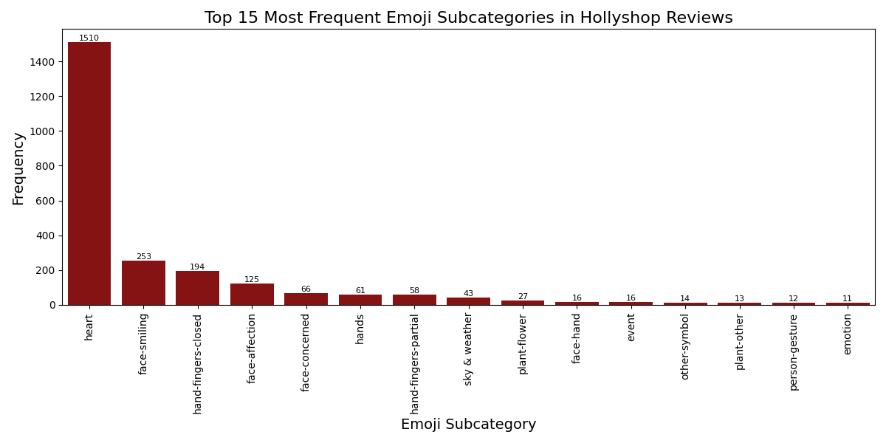
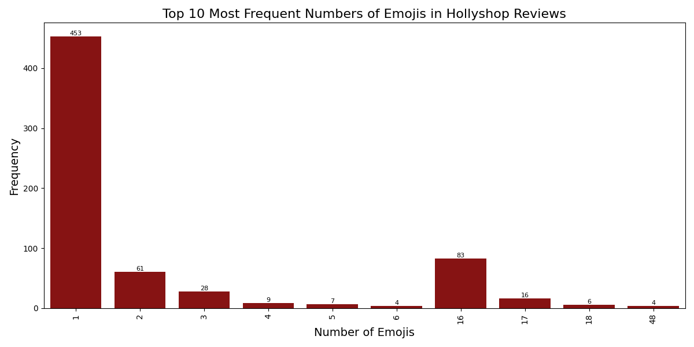
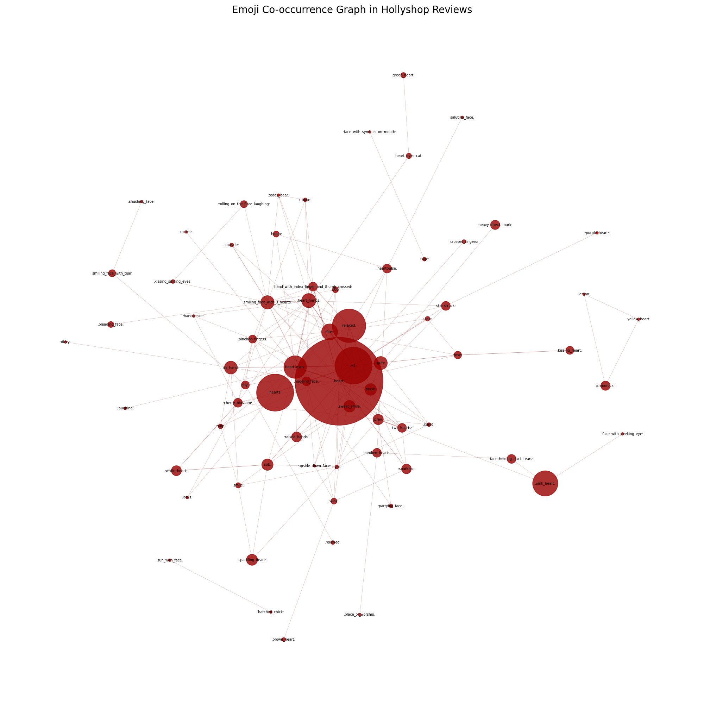
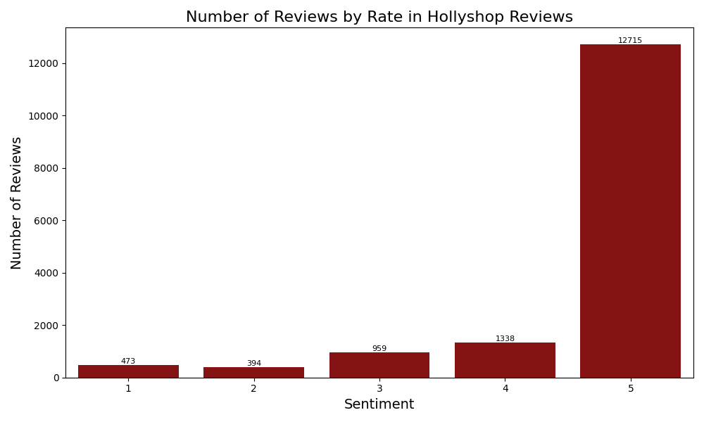
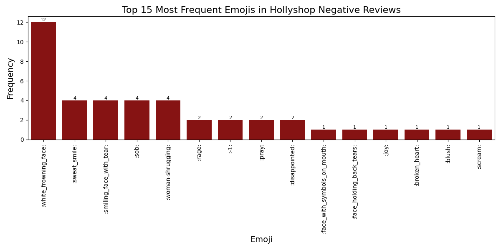

# Linguistic Data: Project (by *Kate Kozlova*)

### Step-by-step
1. I crawled 100 pages of base care products from an online shop [hollyshop](https://hollyshop.ru/) selling Korean cosmetics.
2. I crawled ~3000 pages with reviews on cosmetic product, extracting name, category, review, rate and all the emojis.
3. I fixed and cleared my dataset, converted emojis to pics and text, applied categories to each emoji.
4. I analyzed and visualized my findings from the data.

### GitHub Structure
```
root
│
├─ .gitignore - files to ignore
├─ README.md - this file
├─ requirements.txt - requirements
├─ crawler.py - file with crawling
├─ graph_builder.py - file with graph settings
├─ visualization.ipynb - notebook with visualization
├─ src\ - plots
│   ├─ emoji_graph.png
│   ├─ ...
│   └─ top_15_emoji_subcategories_hollyshop.png
└─ data\ - data
    ├─ hollyshop_emojis_with_categories.csv
    ├─ ...
    └─ hollyshop_top_15_emojis_positive.csv
```

### My Results
#### As was expected, there are only ~700 reviews with emojis (not so much).


#### The most frequent emojis are shown on this plot:

Or see the [table](./data/hollyshop_top_15_emojis.csv) with converted emojis.

#### The distribution of categories can be seen here:
I assigned each emoji its category and subcategory (the original comparison is taken [here](https://raw.githubusercontent.com/chalda-pnuzig/emojis.json/refs/heads/master/src/categories.json) with a bit of manual work) and saved the results in [CSV-file](./data/hollyshop_emojis_with_categories.csv). 



#### What about rare categories?
 - Fire: 🔥 (obviously)
 - Some stars: ✨, 🌟
 - Many flowers: ☘️, 🌸 (Asia), 🌹, 🌺, 🌷, 🪷
 - Some feminine aesthetic emojis: 🦋, 🎀, 🍓, 🧸
 - The full list can be found in [IPYNB](./visualization.ipynb)

#### What about people & body
 - More female emojis than neutral: 🤷‍♀️ (8), 🤦‍♀️ (1), 🙇‍♀️ (1) vs. 🤷 (2)
 - Love symbols: 🫶, 🫰 (Asia)
 - Nails: 💅

#### The distribution of subcategories is here:


#### Do emojis co-ocur? Yes!


#### Here is the graph of co-occurrence


#### What about rating distribution?


#### Reviews with(out) emojis divided by sentiment


#### Most popular positive emojis

Or see the [table](./data/hollyshop_top_15_emojis_positive.csv) with converted emojis.

#### Most popular negative emojis

Or see the [table](./data/top_15_emojis_hollyshop_negative.csv) with converted emojis.

#### The "most frequent" negative emojis
They are seen in most popular emojis overall and in most popular negative emojis. And they are actually not negative (Zoomers culture 😭😭😭)!!

| emojis | count |
|--------|-------|
| 😅      | 4     |
| 😭      | 4     |
| 😊      | 1     |

### Summary
1. More positive reviews with emojis than negative ones.
2. Now, it is hard to distinguish negative vs. positive review by emojis (e.g., 😭, see [IPYNB](./visualization.ipynb)).
3. Some female and Asian vibe (Korean cosmetics).